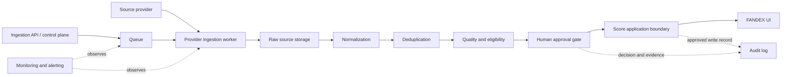

# Production Source Architecture Decision

Status: architecture proposal. The hybrid direction described here is a
recommendation for further evaluation, not a final technology decision or an
implemented production system.

## Decision Context

FANDEX is intended to turn verified web data into variables that can be
reviewed and presented through a stock-page-like product experience. Source Lab
provided a read-only workspace for validating the concepts behind that flow.
The v7–v33 work covered fixtures, helper output, review stages, safety
boundaries, and preview UI; it did not create a production source system.

The next architecture decision must define boundaries for real ingestion,
storage, approval, and score application. In particular, source collection must
remain isolated from FANDEX calculation and serving so that a provider or
pipeline failure cannot directly damage existing scores or product availability.

## Requirements

A future production design should support:

- Independent collection for each source provider
- Preservation of original source items
- Creation of normalized items without replacing raw evidence
- Deterministic duplicate detection
- Quality and eligibility evaluation
- A human approval gate before score application
- An auditable trail from source item to approved outcome
- Recovery or rollback to a previously approved snapshot
- Separation between ingestion logic and FANDEX calculation logic
- Protection of existing scores and service availability during failures
- A stable contract for adding providers without changing the core application

## Architecture Options

| Option | Shape | Advantages | Disadvantages | Suitable scale | Primary operational risks |
| --- | --- | --- | --- | --- | --- |
| A. Next.js internal routes and server actions | Collection and control logic run inside the web application boundary. | Lowest initial infrastructure overhead; direct access to existing UI and application types; simple local development. | Web request lifecycle and ingestion lifecycle become coupled; long-running work, retries, and provider isolation are harder; application deploys affect collection. | Early prototype or very low-volume manual ingestion. | Provider latency can consume web capacity; retry storms or collection failures can affect the product; unclear ownership between UI and jobs. |
| B. Separate ingestion worker or service | Collection, normalization, and pipeline execution live outside the web application. | Strong isolation; independent scaling and deployment; clear worker ownership; suitable for long-running and scheduled jobs. | More service contracts and operational infrastructure; review UI integration requires explicit APIs; potentially premature complexity at small scale. | Sustained multi-provider ingestion with dedicated operational ownership. | Contract drift, duplicated domain logic, service observability gaps, and worker deployments that are difficult to coordinate. |
| C. Next.js dashboard plus queue/worker hybrid | The web app acts as a control and review plane while queued provider workers perform ingestion. | Separates UI from execution; isolates providers; supports retries and backpressure; fits approval workflows; workers can scale independently. | Requires queue semantics, idempotency, job state, and service boundaries to be designed; more components than Option A. | A growing multi-provider product that needs human review and controlled score application. | Stuck or duplicate jobs, queue backlog, partial pipeline completion, and inconsistent state unless contracts and monitoring are explicit. |

### Option A: Next.js-Centered

Option A can validate a narrow manual workflow with minimal infrastructure. Its
main weakness is failure coupling: a web deployment, request timeout, or slow
provider can affect both collection and the FANDEX product surface. It should
not be assumed to scale into a durable ingestion platform without redesign.

### Option B: Separate Worker or Service

Option B provides the clearest runtime isolation and may become appropriate
when ingestion has dedicated ownership and sustained volume. It also creates
the most immediate operational surface area. Without stable domain contracts,
it risks moving complexity into a separate service rather than controlling it.

### Option C: Dashboard and Queue/Worker Hybrid

Option C assigns control, review, and visibility to the FANDEX web application
while workers own provider-specific execution. A queue becomes the boundary for
retry, backpressure, and provider isolation. Approval and score application
remain separate stages rather than automatic consequences of ingestion.

## Recommended Direction

Option C is the recommended direction for FANDEX to evaluate. This is not a
final selection and does not authorize implementation. It is favored because it
can:

1. Separate the UI and control plane from ingestion execution.
2. Contain provider failures within provider-specific workers and jobs.
3. Support queue-based retry and backpressure policies.
4. Connect cleanly to a human approval gate.
5. Protect score calculation from unreviewed or incomplete source work.
6. Add providers behind stable job and normalized-item contracts.

The recommendation should be revisited after provider priorities, expected
volume, storage needs, operating ownership, and failure budgets are known.

## Conceptual Components

The proposed direction contains conceptual roles, not selected products:

- **FANDEX web app:** product UI plus operator review and control surfaces
- **Ingestion API/control plane:** validates commands and creates trackable jobs
- **Queue:** buffers work and provides retry and backpressure boundaries
- **Provider workers:** collect one provider independently through a defined contract
- **Raw source storage:** preserves immutable provider evidence and metadata
- **Normalized source storage:** holds canonical items and deduplication results
- **Review/approval layer:** presents eligibility evidence and records decisions
- **Score application layer:** applies only approved, versioned inputs through a separate boundary
- **Audit log:** links commands, source records, transformations, decisions, and writes
- **Monitoring/alerting:** reports provider health, job failures, backlog, and unsafe state transitions

## Proposed Data Flow

The diagram shows responsibility boundaries only. It is not an executable
workflow, deployment topology, or product selection.

## Failure and Safety Boundaries

- A provider failure must not become a FANDEX web service outage.
- Partial collection failure must retain the last approved data and scores.
- Score application must not run before explicit approval.
- Source items and score results must be stored and versioned separately.
- Rollback should reference a previously approved snapshot, not rerun uncertain ingestion.
- No write should occur without a corresponding audit record.
- Ranking changes must not occur without operator approval.
- Retries must be idempotent so duplicate jobs cannot duplicate source or score writes.
- Incomplete normalization, deduplication, or eligibility work must fail closed before approval.

## Decisions Deferred

This proposal deliberately does not select:

- A cloud provider
- A database product
- A queue product
- Provider-specific authentication methods
- Scheduler frequency
- Cost budget
- Production deployment model
- Physical or logical schemas
- A score formula

These decisions require separate evidence and should not be inferred from the
recommended architecture direction.

## Follow-up Documents

Potential follow-up specifications are:

1. Storage schema ADR
2. Provider priority matrix
3. Ingestion worker contract
4. Approval gate specification
5. Monitoring and incident policy

Each document should preserve the separation between collection, approval,
score application, and product serving established in this proposal.
