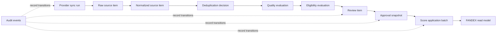

# Production Source Storage Schema ADR

Status: conceptual storage proposal. This document does not select a database,
define an executable schema, or implement persistence.

## Decision Context

The v34 architecture proposal identified a Next.js dashboard plus queue/worker
hybrid as a direction for further evaluation. This ADR describes the conceptual
storage boundaries that such a system would need to preserve the source
lifecycle safely. It does not choose a database product or connect Source Lab
preview helpers to real storage.

The model separates provider evidence, normalization, evaluation, human review,
approval, and score application. This separation is intended to prevent
unreviewed ingestion output from becoming FANDEX ranking input.

## Core Data Principles

- Preserve raw source evidence without overwriting its payload.
- Require every normalized source item to reference its raw source item.
- Keep provider external identifiers separate from FANDEX internal identifiers.
- Store deduplication decisions separately from original records.
- Treat review, approval, and score application as distinct stages.
- Exclude unapproved data from rankings and score application.
- Link every write or state transition to an audit event.
- Base rollback on a previously approved snapshot.
- Prefer retained records and explicit state transitions over destructive deletion, subject to future retention obligations.
- Preserve the latest approved data when collection fails.

## Conceptual Entities

The fields below are semantic concepts, not column names or types.

| Entity | Purpose and key concepts | References | Created when | Mutability | Retention direction | Decisions required before production |
| --- | --- | --- | --- | --- | --- | --- |
| `providers` | Identifies a source provider, its stable `provider_key`, display metadata, capability status, and policy references. | Referenced by sync runs and raw items. | A provider is admitted to the source program. | Provider metadata and enablement may change; identity should remain stable. | Retain while any evidence references the provider. | Ownership, provider lifecycle, terms metadata, and credential boundary. |
| `provider_sync_runs` | Records one collection attempt, trigger context, collection status, timing, counts, and failure summary. | References one provider; groups raw items and audit events. | A collection attempt is accepted by the control plane. | Append progress and terminal outcome; do not rewrite historical results. | Retain long enough for operational and audit investigation. | Retry identity, timeout semantics, terminal states, and retention period. |
| `raw_source_items` | Preserves provider evidence, `external_source_id`, captured payload, source location, capture time, and content fingerprint. | References a provider and sync run; parent of normalized items. | A worker captures an item from a provider. | Payload is immutable after creation; corrections create a new record or explicit amendment. | Retention depends on provider terms, deletion duties, and evidence needs. | Payload boundaries, redaction, versioning, lawful retention, and deletion handling. |
| `normalized_source_items` | Represents a canonical interpretation with `internal_source_id`, normalized attributes, normalizer version, and normalization outcome. | Must reference a raw item; referenced by deduplication and evaluations. | Raw evidence completes a normalization attempt. | Versioned rather than overwritten when interpretation changes. | Retain versions needed to reproduce decisions and approved snapshots. | Canonical field model, version rules, entity linkage, and invalidation policy. |
| `source_deduplication_links` | Records duplicate or related-item decisions, direction, confidence, method version, and canonical target. | Connects normalized items without deleting either source record. | Deduplication compares one or more normalized items. | A new decision may supersede an earlier link; history remains visible. | Retain with affected normalized records and approval evidence. | Canonical selection rules, conflict review, and provider/external-ID collision policy. |
| `source_quality_evaluations` | Captures quality outcome, evidence, reason codes, evaluator version, and evaluation time. | References a normalized item and its relevant deduplication context. | A quality evaluation completes. | Immutable evaluation result; reevaluation creates a new version. | Retain evaluations used by review or approval. | Quality dimensions, thresholds, evaluator versioning, and manual override rules. |
| `source_eligibility_evaluations` | Captures whether an item can proceed, with outcome, reasons, policy version, and dependencies. | References normalized item and quality evaluation. | Eligibility policy evaluates a source candidate. | Immutable result; policy changes create a new evaluation. | Retain evaluations that influenced review or exclusion. | Eligibility policy, fail-closed behavior, expiration, and override authority. |
| `source_review_items` | Presents evidence for human disposition, with `review_item_id`, review state, assignee context, decision rationale, and supersession link. | References normalized item plus quality and eligibility evaluations. | An eligible or exceptional item requires human review. | Review state may transition through audited actions; evidence references remain fixed. | Retain for traceability even after rejection or supersession. | Assignment model, concurrency, decision vocabulary, and appeal or reopen policy. |
| `source_approval_snapshots` | Freezes the exact approved input set, policy versions, approver context, and `approval_snapshot_id`. | References approved review items and their immutable evidence versions. | An authorized approval decision is finalized. | Immutable; changes require a new snapshot that supersedes the previous one. | Retain all snapshots needed for audit, comparison, and rollback. | Snapshot granularity, approval authority, expiration, and supersession rules. |
| `score_application_batches` | Defines one proposed application boundary with `score_batch_id`, target scope, approval snapshot, calculation version, and batch state. | Must reference one approval snapshot; parent of application items. | Approved inputs are prepared for controlled score application. | State transitions are audited; input snapshot cannot change. | Retain applied, failed, and rolled-back batches for reproducibility. | Idempotency key, authorization, batch scope, failure semantics, and rollback protocol. |
| `score_application_items` | Records per-target proposed or applied result, input lineage, outcome, and error context without merging it into source evidence. | References a score batch and the affected FANDEX target/read-model identity. | A score batch materializes target-level work. | Proposed values remain fixed; corrections use a new batch or rollback record. | Retain with the batch and relevant approved snapshot. | Target contract, partial failure policy, read-model publication, and reconciliation. |
| `audit_events` | Provides `audit_event_id`, actor or system identity, action, timestamp, reason, correlation context, and before/after references. | Links writes and transitions across all lifecycle entities. | Before or atomically with an auditable state change. | Append-only; corrections are additional events. | Retention must support investigation while respecting future policy. | Atomicity model, actor identity, tamper evidence, access control, and retention. |

## Identifier Boundaries

| Identifier | Required uniqueness boundary |
| --- | --- |
| `provider_key` | Globally unique and stable within the FANDEX source platform. |
| `external_source_id` | Unique only within a provider and its documented content namespace; it must not be treated as globally unique alone. |
| `internal_source_id` | Globally unique FANDEX identity for the canonical source concept, independent of provider identifiers. |
| `raw_item_id` | Globally unique identity for one immutable capture of provider evidence. Multiple captures may share an external source ID. |
| `normalized_item_id` | Globally unique identity for one versioned normalization result. |
| `review_item_id` | Globally unique review work identity; reopening or superseding rules must not erase the earlier review. |
| `approval_snapshot_id` | Globally unique immutable approval snapshot identity. |
| `score_batch_id` | Globally unique, idempotently addressable score application batch identity. |
| `audit_event_id` | Globally unique append-only audit event identity, also correlated to a command, job, or batch where relevant. |

The pair of `provider_key` and `external_source_id` requires an explicit
duplicate and recapture policy. Neither value replaces immutable `raw_item_id`
or canonical `internal_source_id` identity.

## Conceptual Source Lifecycle

This is a conceptual data lifecycle, not an executable workflow. Each arrow
means that lineage should be preserved; it does not prescribe synchronous
execution, storage technology, or deployment topology.

## State Model

Example state terms include `collected`, `normalized`, `duplicate`, `eligible`,
`ineligible`, `pending_review`, `approved`, `rejected`, `superseded`, `applied`,
`rolled_back`, and `failed`. They should not be collapsed into one lifecycle
status field.

At minimum, the design should separate:

- **Collection and transformation state:** collection, normalization, and failure outcomes
- **Evaluation and review state:** quality, eligibility, pending review, approval, rejection, and supersession
- **Application state:** prepared, applied, failed, and rolled back

Separate state families avoid invalid transitions such as treating a collected
item as approved or treating a failed application as failed ingestion. Exact
state machines remain a follow-up decision.

## Data Invariants

1. A raw item's captured payload is not overwritten after creation.
2. Every normalized item references exactly one preserved raw item version.
3. An approval snapshot freezes the approved input set and relevant policy versions.
4. Score application cannot begin without an approval snapshot.
5. No write or state transition occurs without a linked audit event.
6. A rejected review item cannot be included in a score application batch.
7. A failed sync run does not invalidate an existing approved snapshot.
8. Rollback does not delete raw or normalized source evidence.
9. The combination of provider and external ID has an explicit duplicate, recapture, and conflict policy.
10. Partial collection or application failure does not replace the last approved FANDEX read model.

## Retention and Personal Data Boundaries

The raw payload retention period is undecided. Future policy should minimize
collection of personal or sensitive information and consider provider terms,
source deletion, correction requests, and applicable obligations. Publicly
available content should not be assumed to permit indefinite retention.

This section identifies design questions only. It is not legal advice or a
final privacy, deletion, or retention policy. Production work requires review
of source-specific terms and data handling requirements before collection.

## Storage Model Options

| Option | Advantages | Disadvantages | Query convenience | Provider extensibility | Audit and rollback fit | Operational complexity |
| --- | --- | --- | --- | --- | --- | --- |
| A. Fully relational | Explicit constraints and relationships; predictable normalized queries; strong reporting model. | Provider payload differences can create wide or frequently changing schemas; raw fidelity may be awkward. | High for known cross-provider fields and lifecycle joins. | Moderate; new provider attributes may require schema evolution. | High when version and event entities are modeled explicitly. | Moderate to high as schema and migrations expand. |
| B. Document-centered payload | Preserves heterogeneous provider payloads with low initial modeling cost. | Cross-provider validation, joins, constraints, and lifecycle reporting are harder; semantics can drift into application code. | High for retrieving whole provider records, lower for governed cross-provider analysis. | High for accepting new payload shapes, lower for canonical consistency. | Moderate to low unless immutable versions and audit links are separately enforced. | Low initially, potentially high as query and governance needs grow. |
| C. Relational metadata plus JSON raw payload hybrid | Keeps raw evidence flexible while lifecycle identity, lineage, review, approval, and audit remain explicit. | Requires disciplined boundaries between raw payload and canonical fields; two query styles and version policies must be governed. | High for lifecycle queries and adequate for provider-specific evidence inspection. | High when adapters preserve raw payload and emit a stable normalized contract. | High if snapshots, batches, and audit relationships are relational and immutable. | Moderate; more design work than a document-only start, less schema churn than fully relational raw payloads. |

## Recommended Direction

Option C is the recommended direction for further evaluation: relational
metadata and lifecycle relationships combined with a preserved JSON-like raw
payload. It aligns raw evidence flexibility with explicit lineage, approval,
audit, and rollback boundaries.

This recommendation is not a final schema or database decision. It depends on
provider payload analysis, query requirements, retention review, expected
volume, and proof that immutable evidence and atomic audit linkage can be
enforced by the eventual platform.

## Decisions Deferred

This ADR does not select or define:

- Database or cloud provider
- Physical column types
- Index definitions
- Partition strategy
- Retention periods
- Encryption method
- Backup frequency
- Migration tool
- ORM
- Score formula
- Personal data processing policy

## Follow-up Documents

Potential follow-up specifications are:

1. Provider priority matrix
2. Ingestion worker contract
3. Approval gate specification
4. Audit and rollback policy
5. Monitoring and incident policy

Each follow-up should preserve immutable raw evidence, versioned derived data,
explicit approval, auditable writes, and separation from the FANDEX read model.
